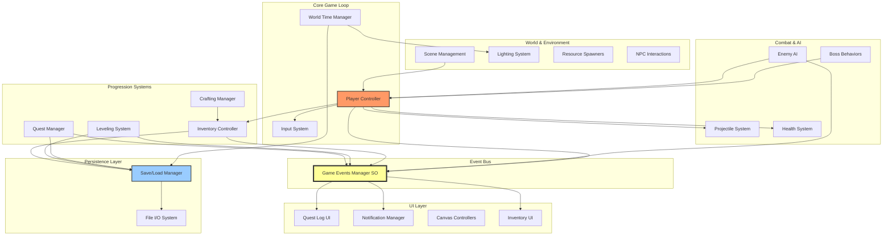
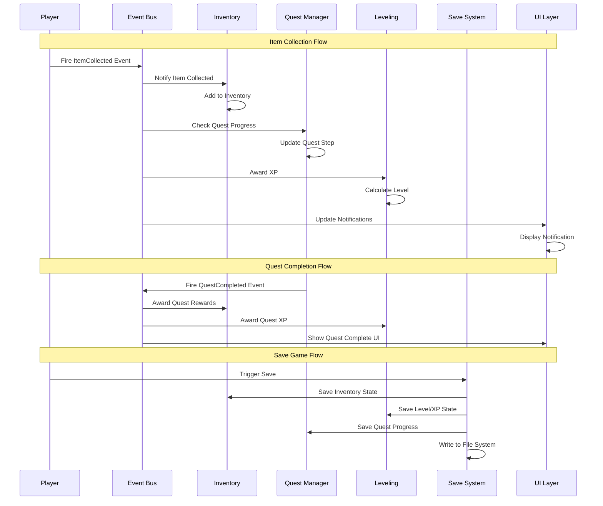
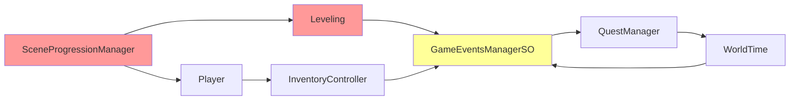
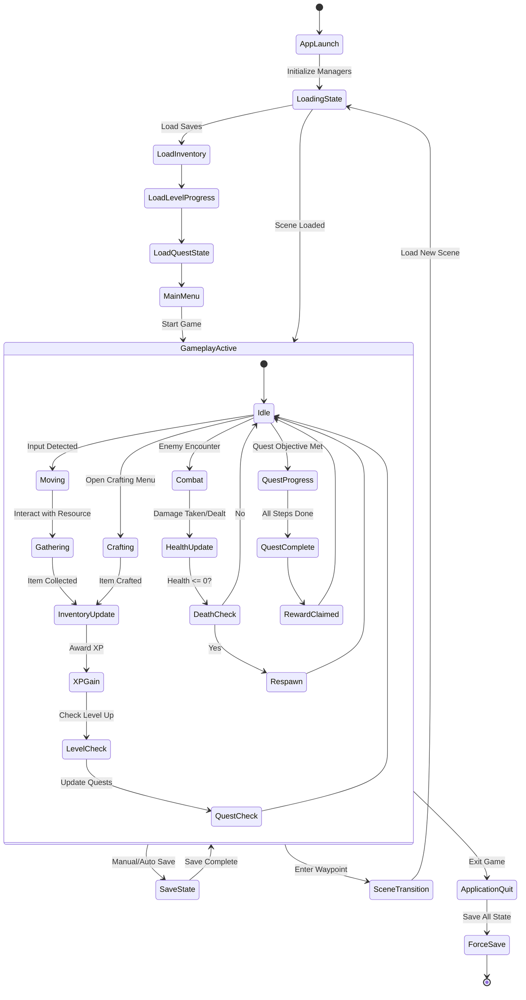
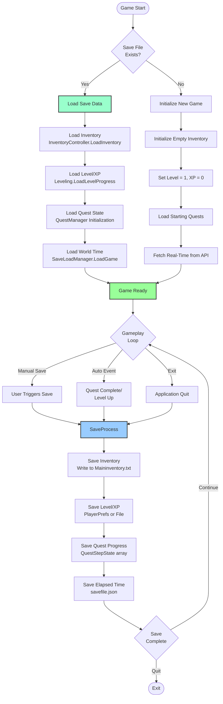

# Revita Rogue - As-Is System Analysis

**Document Version:** 1.0  
**Analysis Date:** February 15, 2026  
**Total C# Files Analyzed:** 106 files  
**Unity Version:** 2021.3 LTS

---

## Executive Summary

Revita Rogue is a 2D post-apocalyptic survival game built with Unity. This document provides a comprehensive As-Is analysis of the codebase, covering system decomposition, health assessment, and state/data flow patterns. The analysis reveals a mature event-driven architecture with some areas requiring refactoring to reduce coupling and improve maintainability.

**Key Findings:**
- Event-driven architecture with centralized event management
- 12+ major subsystems with clear domain boundaries
- Heavy reliance on runtime object discovery (FindObjectOfType)
- Multiple save/load entry points requiring consolidation
- God classes handling excessive responsibilities

---

## 1.1 System Decomposition

### High-Level Architecture Diagram



### System Interaction Diagram



### Dependency List

#### Core Systems Dependencies

| System | Dependencies | Communication Method |
|--------|--------------|---------------------|
| **Player Controller** | InputManager, InventoryController, Health, GameEventsManagerSO | Direct calls + Events |
| **Quest Manager** | GameEventsManagerSO, WorldTime, QuestStepState, ScriptableObjects | Events + Direct |
| **Inventory Controller** | GameEventsManagerSO, NotificationManager, FileIO | Events + FindObjectOfType |
| **Crafting Manager** | InventoryController, NotificationManager, ItemDatabase | FindObjectOfType |
| **Leveling System** | GameEventsManagerSO, PlayerPrefs/FileIO | Events |
| **Enemy AI** | Player, Leveling, Health, Rigidbody2D | FindObjectOfType |
| **Scene Manager** | SceneData (static), Player, Leveling | Direct + Static State |
| **World Time** | SaveLoadManager, Light2D[], GameEventsManagerSO | Direct + Events |
| **Save/Load Manager** | InventoryController, Leveling, QuestManager | Direct calls |
| **UI Systems** | GameEventsManagerSO, respective managers | Events |

#### External Package Dependencies

- Unity Input System (com.unity.inputsystem)
- Unity 2D Lighting System
- Unity UI (TextMeshPro)
- .NET File I/O (System.IO)
- JSON Serialization (Unity JsonUtility)

#### Key ScriptableObject Assets

- **GameEventsManagerSO** - Central event hub
- **QuestInfoSO** - Quest definitions
- **ItemSO** - Item database entries
- **Recipe Data** - Crafting recipes

---

## 1.2 Codebase Health Assessment

### Module Ownership Table

| Module | Primary Class(es) | Responsibility | Complexity | Singleton Pattern |
|--------|------------------|----------------|------------|------------------|
| **Quest System** | QuestManager.cs | Quest state machine, step tracking, timer logic | High | FindObjectOfType |
| **Inventory** | InventoryController.cs | Item storage, persistence, slot management | High | Destroy duplicate |
| **Crafting** | CraftingManager.cs | Recipe validation, item creation | Medium | Destroy duplicate |
| **Leveling** | Leveling.cs | XP tracking, level progression | Medium | Standard |
| **Event System** | GameEventsManagerSO.cs | Centralized event broadcasting | Low | Resources.Load<> lazy |
| **Player Control** | Player.cs | Movement, combat, health, interactions | **Very High** | None (scene-based) |
| **World Time** | WorldTime.cs | Time sync, day/night cycles | High | None (scene-based) |
| **Scene Management** | SceneProgressionManager.cs | Level transitions, difficulty scaling | Medium | Standard |
| **Enemy AI** | AIchase.cs, Boss2.cs, Boss3.cs | Enemy behavior, pathfinding, combat | Medium | None |
| **Save/Load** | SaveLoadManager.cs, InventoryController (partial) | Data persistence | Medium | Mixed ownership |
| **UI/Notifications** | NotificationManager.cs | Toast notifications, UI updates | Low | FindObjectOfType |
| **Input Management** | InputManager.cs, PlayerActionMap.cs | Input mapping, action handling | Medium | Standard |

### Dependency Risk Notes

#### 🔴 Critical Issues

**1. FindObjectOfType Overuse (150+ occurrences)**
- **Risk Level:** HIGH
- **Impact:** Performance degradation, runtime failures
- **Examples:**
  - `CraftingManager` → `FindObjectOfType<NotificationManager>()`
  - `Salvage` → `FindObjectOfType<InventoryController>()`
  - `AIchase` → `FindObjectOfType<Player>()`, `FindObjectOfType<Leveling>()`
  - `ItemManager` → `FindObjectOfType<InventoryController>()`
- **Issue:** O(n) scene search on every Awake/Start, fragile if objects don't exist
- **Recommendation:** Implement Dependency Injection or Service Locator pattern

**2. God Classes**
- **Player.cs (~500+ lines estimated)**
  - Responsibilities: Movement, combat, health, stamina, inventory access, gathering, flashlight, animation, audio, event broadcasting
  - Risk: Single Point of Failure (SPoF), difficult to test, violates SRP
  - Recommendation: Extract into PlayerMovement, PlayerCombat, PlayerInventoryBridge, PlayerAnimator components

- **WorldTime.cs (~400+ lines estimated)**
  - Responsibilities: Real-time API sync, offline mode, day/night cycle, lighting control, event broadcasting
  - Risk: Network dependency, complex state management
  - Recommendation: Separate TimeProvider, LightingController, TimeEventBroadcaster

- **InventoryController.cs (~300+ lines estimated)**
  - Responsibilities: Slot management, drag/drop, persistence, event handling
  - Risk: Mixed concerns (UI + data + persistence)
  - Recommendation: Split into InventoryData, InventoryPersistence, InventoryUI

**3. Cyclic Dependencies**


**4. Multiple Save Entry Points**
- **Risk Level:** HIGH
- **Locations:**
  - `SaveLoadManager.cs` - Elapsed time only
  - `InventoryController.cs` - Inventory to text file
  - `Leveling.cs` - XP/Level to PlayerPrefs
  - `QuestManager.cs` - Quest state (unclear persistence)
- **Issues:**
  - No transaction safety
  - Data loss on crash (OnApplicationQuit saves)
  - Inconsistent save formats (JSON vs text vs PlayerPrefs)
- **Recommendation:** Centralized SaveManager with transactional saves

#### ⚠️ Medium Risk Issues

**5. Static State Leakage**
- **SceneData** (static class) holds game progression state
- **Risk:** State persists across scene reloads in editor, hard to test
- **Recommendation:** Convert to ScriptableObject singleton

**6. Event Bus Bottleneck**
- All events funnel through single `GameEventsManagerSO`
- 6 event categories (input, player, item, quest, misc, enemies)
- **Risk:** No priority system, potential frame hitches with 100+ subscribers
- **Recommendation:** Implement event priority queuing or dedicated buses per domain

**7. Missing Null Safety**
- Heavy use of `GetComponent<>()` and `FindObjectOfType<>()` without null checks
- **Risk:** NullReferenceExceptions at runtime
- **Recommendation:** Defensive coding with null checks or Unity's `RequireComponent` attribute

#### ✅ Low Risk / Strengths

**8. Event-Driven Architecture**
- Loose coupling via ScriptableObject event pattern
- Clean separation between event producers and consumers
- Easy to add new subscribers without modifying publishers

**9. Scriptable Object Data Design**
- Quest definitions (QuestInfoSO)
- Item database (ItemSO)
- Enables designer-driven content without code changes

**10. Component-Based Enemy AI**
- Each enemy type is a separate component
- Easy to extend with new behaviors
- Clear separation from player logic

### Technical Debt Summary

| Category | Issue Count | Priority | Estimated Effort |
|----------|-------------|----------|------------------|
| FindObjectOfType Refactoring | 150+ | P0 | 3-5 days |
| God Class Decomposition | 3 | P0 | 5-7 days |
| Save System Consolidation | 1 | P1 | 2-3 days |
| Cyclic Dependency Resolution | ~5 | P1 | 3-4 days |
| Null Safety Hardening | ~50 | P2 | 2-3 days |
| Event Bus Optimization | 1 | P3 | 1-2 days |

**Total Estimated Effort:** 16-24 days for critical P0/P1 issues

---

## 1.3 State & Data Flow

### State Lifecycle Diagram



### Save/Load Flow Diagram



### State Mutation Map

```mermaid
graph TD
    subgraph "Player State"
        PS_Health[Health: 0-MaxHealth]
        PS_Stamina[Stamina: 0-MaxStamina]
        PS_Position[Position: Vector2]
        PS_Inventory[Inventory: Item[]]
    end
    
    subgraph "Progression State"
        Prog_XP[Experience: int]
        Prog_Level[Level: 1-20]
        Prog_Quests[Active Quests: Quest[]]
    end
    
    subgraph "World State"
        World_Time[Current Time: DateTime]
        World_Scene[Active Scene: string]
        World_Difficulty[Scene Difficulty: int]
    end
    
    subgraph "Mutation Sources"
        E_Combat[Combat Events]
        E_Gather[Gathering Events]
        E_Craft[Crafting Events]
        E_Quest[Quest Events]
        E_Scene[Scene Events]
    end
    
    E_Combat --> PS_Health
    E_Combat --> Prog_XP
    
    E_Gather --> PS_Inventory
    E_Gather --> Prog_XP
    
    E_Craft --> PS_Inventory
    
    E_Quest --> Prog_Quests
    E_Quest --> PS_Inventory
    E_Quest --> Prog_XP
    
    E_Scene --> World_Scene
    E_Scene --> World_Difficulty
    
    Prog_XP --> Prog_Level
    
    subgraph "Persistence"
        File_Inv[Maininventory.txt]
        File_Level[PlayerPrefs]
        File_Quest[In-Memory Only?]
        File_Time[savefile.json]
    end
    
    PS_Inventory -.Save.-> File_Inv
    Prog_Level -.Save.-> File_Level
    Prog_Quests -.Save?.- File_Quest
    World_Time -.Save.-> File_Time
    
    File_Inv -.Load.-> PS_Inventory
    File_Level -.Load.-> Prog_Level
    File_Quest -.Load?.- Prog_Quests
    File_Time -.Load.-> World_Time
    
    style File_Inv fill:#fcc,stroke:#333
    style File_Level fill:#fcc,stroke:#333
    style File_Quest fill:#faa,stroke:#333,stroke-dasharray: 5 5
    style File_Time fill:#fcc,stroke:#333
```

### State Ownership & Mutation Rules

| State Type | Owner | Mutators | Persistence | Load Timing |
|------------|-------|----------|-------------|-------------|
| **Player Health** | Health.cs | Combat events, consumable items | Not persisted (resets) | N/A |
| **Player Stamina** | Player.cs | Sprinting, food items | Not persisted (resets) | N/A |
| **Player Position** | Player.cs Transform | Input system | Scene-specific | On scene load |
| **Inventory Items** | InventoryController.cs | Pickup, drop, craft, quest rewards | `Maininventory.txt` | On app start |
| **Player XP/Level** | Leveling.cs | Combat, gathering, quests | PlayerPrefs or file | On app start |
| **Active Quests** | QuestManager.cs | Quest events (start, progress, complete) | **Unclear** | On scene load |
| **World Time** | WorldTime.cs | Real-time API, coroutine updates | `savefile.json` (elapsed only) | On app start |
| **Scene Progression** | SceneProgressionManager.cs | Scene transitions | SceneData (static) | On demand |
| **Crafting Recipes** | CraftingManager.cs | Designer-defined (SO) | Not persisted (static data) | On scene load |

### Data Flow Patterns

#### Pattern 1: Event-Driven Data Flow
```
Source → GameEventsManagerSO.RaiseEvent() → Subscribers.OnEventRaised() → State Update
```
**Example:** Item collection
```
Player.OnTriggerEnter → itemEvents.ItemCollectedWithCount → 
  InventoryController.UpdateItemCount → Inventory State Updated
```

#### Pattern 2: Direct Call Data Flow
```
Source → Manager.Method() → State Update
```
**Example:** Crafting
```
CraftingSlot.CraftItem() → CraftingManager.Craft() → 
  InventoryController.AddItem() → Inventory State Updated
```

#### Pattern 3: Polling Data Flow
```
Update() → Check State → React to Change
```
**Example:** Quest timer
```
QuestManager.Update() → Check Quest Timers → 
  If expired: AdvanceQuest() → Update Quest State
```

### Implicit vs Explicit State Transitions

#### ✅ Explicit State Transitions

- **Quest State Machine:**
  ```csharp
  enum QuestState {
      REQUIREMENTS_NOT_MET,
      CAN_START,
      IN_PROGRESS,
      CAN_FINISH,
      FINISHED
  }
  ```
  Transitions are explicit via `ChangeQuestState()` method

- **Inventory Operations:**
  Clear `AddItem()`, `RemoveItem()`, `SwapItems()` methods

#### ⚠️ Implicit State Transitions

- **Player Health Death:**
  No explicit state machine, checked via `if (health <= 0)` scattered across code

- **Scene Progression:**
  Static `SceneData` class mutated implicitly without clear transition methods

- **Level Up:**
  Happens implicitly when XP crosses threshold, no state machine

### Save/Load Boundaries

#### Saved State
✅ **Persisted:**
- Inventory contents and counts
- Player XP and level
- Elapsed world time
- Scene progression (via static class)

❌ **Not Persisted (Resets):**
- Player health/stamina
- Enemy states and positions
- Resource spawn states
- Quest progress (unclear/incomplete)
- Player position in scene

#### Critical Issue: Quest Persistence
**Status:** INCOMPLETE
- QuestManager has `QuestStepState[]` structure
- No clear save/load methods found for quest state
- Quest progress may reset on app restart
- **Recommendation:** Implement `SaveQuestProgress()` and `LoadQuestProgress()` methods

---

## Recommendations Summary

### Immediate Actions (P0)
1. **Refactor FindObjectOfType calls** → Implement Service Locator
2. **Decompose God Classes** → Extract responsibilities into smaller components
3. **Consolidate Save System** → Single SaveManager with transaction safety

### Short-Term Actions (P1)
4. **Resolve Cyclic Dependencies** → Use interfaces and dependency inversion
5. **Implement Quest Persistence** → Complete save/load for quest state
6. **Add Null Safety** → Defensive coding and null checks

### Long-Term Actions (P2-P3)
7. **Event Bus Optimization** → Priority queuing for events
8. **Static State Removal** → Convert SceneData to ScriptableObject
9. **Unit Test Coverage** → Focus on state transitions and save/load logic

---

## Appendix: Key Files Reference

| File | Lines (Est.) | Primary Responsibility |
|------|--------------|----------------------|
| `Player.cs` | 500+ | Player controller (god class) |
| `InventoryController.cs` | 300+ | Inventory management |
| `QuestManager.cs` | 400+ | Quest state machine |
| `WorldTime.cs` | 400+ | Time and lighting system |
| `GameEventsManagerSO.cs` | 150+ | Event bus hub |
| `Leveling.cs` | 200+ | XP and level progression |
| `CraftingManager.cs` | 250+ | Crafting logic |
| `AIchase.cs` | 200+ | Basic enemy AI |
| `Boss2.cs` / `Boss3.cs` | 300+ each | Boss behaviors |
| `SaveLoadManager.cs` | 100+ | Partial save system |

**Total Analyzed Code:** ~3,500+ lines of core systems (excluding UI and utilities)

---

**Document End**
